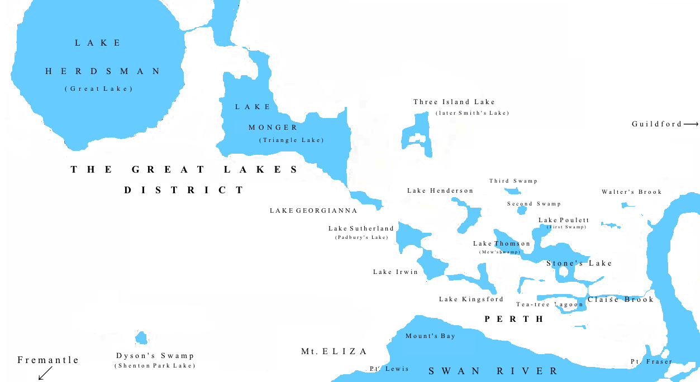
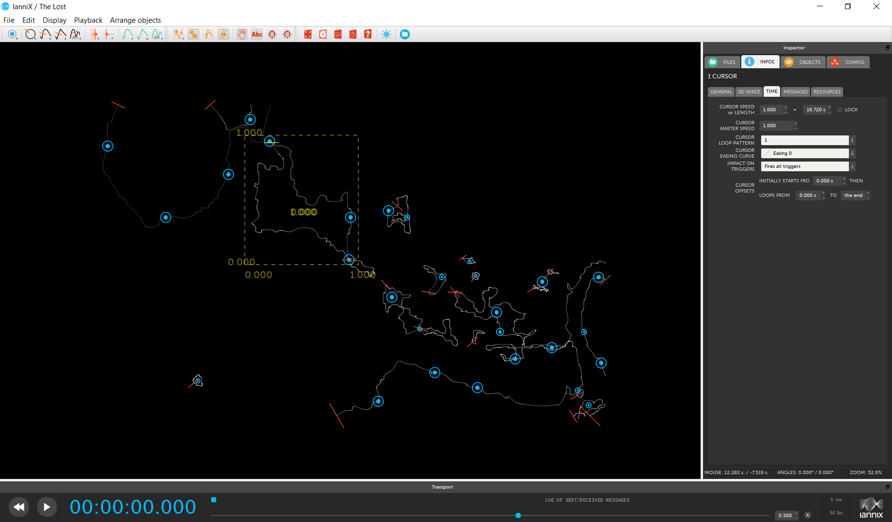
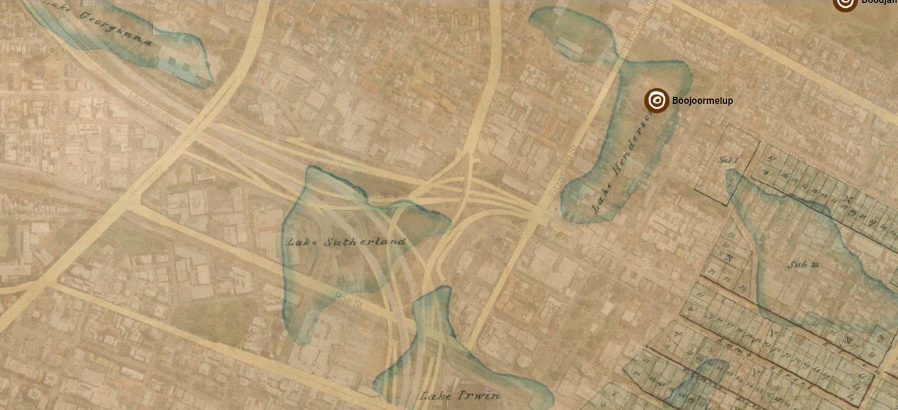
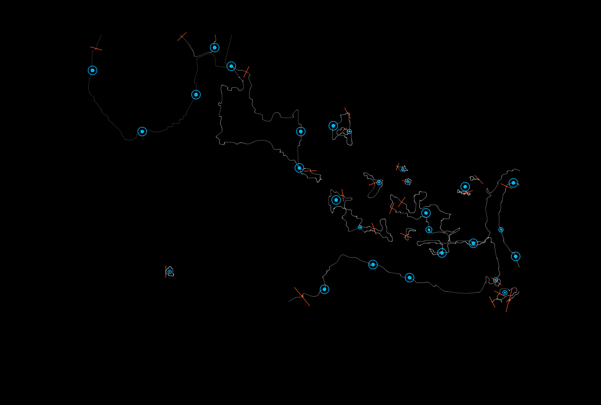

# Introduction

Landscapes can invoke deep and visceral emotions within artists, often
acting as a conduit for creative inspiration. Being immersed within a
place can be a powerful experience, with past and present memories
constantly intersecting as an individual traverses a place. The act of
immersion into a landscape can lead to the creation of multiple forms of
dialogue - firstly, within the artist themselves as they process
thoughts and emotions a landscape triggers within them, then secondly
between the artist and the landscape as they forge navigational methods
over the land's geography.

My practice has been focused on exploring methods of expressing the
relationship between self and place through the creation of digital
audio-visual works. I have been interested in combining reflections on
my personal experiences with place in the creation of multi-layered
work, in order to reflect upon multiple narratives of place.
Underpinning my practice is exploring the visceral relationship between
observer and the landscape, and how to express personal narratives
formed during my time in a place to an audience.

Combining aural and visual elements of a place can be a powerful way of
exploring the intersections of time, history and geographical features
that exist within a location. A challenge for works based on place are
situating multiple sources of information (chiefly, combining visual and
aural information) and weaving these sources into a multi-layered
narrative. The combination of sound and images can provide a
multi-sensory experience of place for people, and allows for the
convergence of geographical and cultural aspects.

This paper will be presented in three parts, starting with an
introduction to place and self-reflexive practices in music composition,
followed by a broad overview of sound mapping, and finally moving onto a
discussion on one of my works influenced by these concepts, titled *The
Lost (2021).*

# Place and Self-Reflective Practice

Any discussion of place requires unpacking of the meaning of 'place',
and how such a definition can be applicable universally. In the simplest
sense, 'place' is used to refer to either a location or the occupation
of said location, differentiated from the concept of 'space' due to its
increased specificity. The idea of place covers cultural, social and
personal expectations, as well as geographic boundaries and shapes.
There is also the symbolic role of place as a metaphor, turning physical
reality into a cultural representation (de San Eugenio-Vela, 2014, p.
21) and mediating the relationship between the person and the natural
scene through cultural references. Some attempts to acknowledge and
incorporate these myriad aspects include John Agnew's definition of
place as a threefold process -- physical place (as a location),
relationship of a site to its spatial boundaries (the locale), and the
cognitive and physical interactions between human and site (sense of
place) (Agnew, 2011, p 23).

In my work, I view the concept of 'place' in the widest sense,
conceiving of it as a layering of narratives encompassing its
physicality, ecology, embedded knowledge such as its associated history
and culture, and the intersections these facets have with my own
personal history and responses. My interest in natural environments and
landscape originated from noticing how a place affected me during a
visit. As noted earlier, I have been interested in combining reflections
on my personal experiences with place in the creation of multi-layered
work, combining multiple narratives of place -- echoing cultural
geographer James Thurgill's observation that works can be both
representations *of* a place, as well as representations of the time
spent *within* place (Thurgill, 2016). In my audio-visual creative
works, there is a blurring of boundaries between different temporalities
and narratives. I believe this compositional approach offers a holistic
view of a place and offers valuable insight into the internal processes
behind the work.

Thurgill also notes the difficulty that inevitably arises when
discussing the notion of 'place', particularly the subjectiveness of the
idea itself. Seemingly, any discussion of place by an observer is
coloured by various external expectations and internal processes:

> Where the work created aims to produce, map out, or provide a reading
> of what I term the biography of place, that is, its history,
> encounters, its potential ... these types of work are often rooted,
> locative and even cartographic in nature. Furthermore, it can be
> suggested that these types of topocentric artworks can occur twofold:
> firstly, as representations of place and secondly, as representations
> in place. (Thurgill, 2016)

Edward Relph offers a similar definition of place, conceptualising place
as a "centres of our immediate experiences of the world" (Relph, 1976,
p. 141). This definition of place acknowledges the immediacy in which
'place' is felt by an individual. If a 'place' can be defined as
physical areas that play host to our experiences, then by extension it
acts as a framework to understand place-specific and place-inspired
works, which strive to replicate, represent and perhaps even invoke
these levels of experience.

The landscape shapes much of the human experience of the land - for
instance, in the ways in which we use physical demarcations and
descriptions for place, and how we determine our movements within these
boundaries. Much has been written about landscape and the human
experience, particularly in regards to psychological and spiritual
connections and landscape as a cultural construct. How a landscape is
interpreted is heavily dependent on cultural context, or as Simon Schama
describes, "...constructions of the imagination projected onto wood and
water and rock" (Schama, 1995, p 61).

In essence, there is a broad duality in how landscape can be viewed -
both as an entity to be seen by those experiencing a place, and also as
a way of perceiving the world (see Wylie 2007). This concept of
perceiving acknowledges the ways in which landscape engages the senses,
as well as its emotional affect. Denis Cosgrove, a prominent human
geographer, notes:

> In other words landscape denotes the external world mediated through
> subjective human experience in a way that neither regions nor area
> immediately suggest. Landscape is not merely the world we see, it is a
> construction, the composition of the world. Landscape is a way of
> seeing the world (Cosgrove, 1984, p. 13).

In terms of sound composition, artists have often been inspired by
place, creating scores that emulated sounds from both natural and human
environments. The advent of recording technology meant that artists were
now also able to bring entire soundscapes from one area to another,
through field recordings. Regarding the availability of recording
technology, British composer David Toop noted how this changed the way
composers could relate to sound and place: "The fact that these noises
also began existing as recordings suggested you could use them as they
were - not by imitating them with an oboe, but by actually bringing in
the sounds themselves" (Nichols, 2017). Being able to bring recordings
into works also changed the interaction between the listener and place,
through developing greater awareness of sounds that occur. Toop
continues:

> It's a framing of listening within a particular setting, where you'd
> normally expect to hear music that's deliberately separate from the
> environment: a shocking gesture in one sense. But in another, it
> forces the audience to listen to the world around them, and consider
> those noises as performance (Toops, in Nichols, 2017).

The idea of how composers can relate to sound and place can also extend
to the process field recording itself, and the narratives existing
within the recordist. Field recording have largely been perceived as
recording-as-documentation or as a process of gathering sonic material,
with the focus being on capturing impartial and neutral artifacts of
soundscapes. The narratives that exist within the recordist, however,
have been generally less acknowledged. Field recordings attain greater
meaning for the listener when the personal narratives and motivations of
the field recordist are openly acknowledged. Isobel Anderson and Tullis
Rennie eloquently outlines the importance of highlighting personal
narratives, noting that: "(the) meaning of the sounds within these
recordings may have a personal significance to their recordist, which
may bring greater meaning to the overall soundscape for the listener, if
divulged" (Anderson and Rennie, 2016, p 223). For Anderson and Rennie,
these personal narratives should be celebrated and highlighted, as a way
of creating deeper knowledge about place.

Field recordist Steven Feld echoes a similar sentiment about his work.
For Feld, there is a sense of deep embodiment in his recordings - a
presence of his existence as listener, even though his presence might
not always be clearly audible to audiences. Feld explains that:

> I am always part of my recordings. I can always listen to my
> recordings and recover my breath, my bodily presence...the recording
> is always the audible trace of my presence as a listener. My
> recordings are always an archive of my history of listening and of the
> history of listening that is being recorded. You could say that my
> field-recording praxis is to listen to histories of listening. That is
> why I am always part of the recording, always present in some way even
> if that presence is not audibly legible to the listener. (Feld, in
> Carlyle and Lane, 2013, p. 209)

Sound is therefore a powerful medium for artists to reflect upon their
personal reflections of place - the history, the geography, and their
own emotive responses. Sound can be the conduit for mediating knowledge
and imagination - where concepts of landscape, place and meaning can be
situated together. For instance, the contours and resonances of the land
can be captured and expressed through field recordings, i.e. the rushing
cascade of water onto rocks, the wind through trees, and the animal
sounds highlighting its inhabitants. The history of a place can be
alluded to through using fragments of historical texts, or by
manipulating field recordings to evoke the past. All these aspects can
then be used by the artist in the creation of artefacts that channel
these emotions and memories.

There have been several composers who have explored field recordings as
a form of self-reflexive practice, such as Luc Ferrari's *Presque Rien*
series (1967-1970, 1977), where Ferrari weaves narration over field
recordings. Ferrari's first foray, *Presque rien, ou le lever du jour
au bord de la mer* *(Almost nothing, or daybreak at the seashore),*
recorded in Vela Luka, Croatia and released in 1970, was an early
demonstration of a field recording being used both as a part of
composition and as auditory memory making.

While in Vela Luka, Ferrari spent several weeks exploring the village
and surrounds with his partner, Brunhild Meyer Ferrari. As they explored
the area, Ferrari became increasingly drawn to the sonic environment and
his responses to what was happening, and recorded for several mornings.
As noted by Lawrence English in his essay about the work, "In Presque
Rien No. 1, Ferrari perceived that his listening, as an affective and
agentive performance within a given horizon, was not absolute or
ongoing, but rather highly selective in attentiveness and temporality"
(English, 2017, p 17).

Two other artists who have explored field recordings and self-reflexive
narrative are Hildegard Westerkamp and Janet Cardiff. Both artists have
created work that interwove narration over field recording as a way of
explaining to listeners the personal significance of an area for them.
In their works, listening is also an act of combining multiple streams
of information of place - sonic, spatial and social - into the creation
of a work.

Hildegard Westerkamp describes how she uses field recordings and their
manipulation as a way to get in touch with her inner self:

> In my electroacoustic compositions my inner voices speak and in that
> form I have been able to make them public ... Seeing how many people
> enjoy working in isolated environments ... tells me I am not the only
> one who needs such a place to get in touch with the inner world ...
> Such a situation can potentially get us in touch with an inner
> vitality and creative spirit*.* (Westerkamp, in McCartney, 1999, p
> 402)

Westerkamp channels her personal emotions and memories in many of her
works. In *Kits Beach Soundwalk* (1989), for example, she explores her
affinity with Vancouver's Kits Beach through a combination of field
recordings and spoken contemplations. Similar to Ferrari's approach in
*Presque Rien*, Westerkamp also offers commentary interspersed
throughout the piece. Westerkamp's commentary, overlaid in the studio,
explains the significance of certain parts of Kits Beach with the
listener, and also openly signposts her audio manipulations. For
instance, in one section, Westerkamp informs the listener how she is
diminishing the sound of traffic to amplify the sound of the ocean
because the view is "beautiful. In fact, it is spectacular" (Anderson
and Rennie, 2016, p 227).

In a similar vein to Westerkamp, Cardiff also establishes herself within
soundscape recordings through her series of soundwalk compositions,
where she narrates over a composed soundscape. In works such as *A Large
Slow River* (2000), Cardiff uses Lake Ontario as a setting for
discussing memory and time, and particularly how certain geographical
features of place act as triggers for personal history. A Large Slow
River directs listeners along a certain, specific route, and during the
soundwalk, listeners are encouraged to explore and engage with the
historical, cultural and natural aspects of place. In some passages,
Cardiff's narration is evocative in its shifting of temporality from
past to present as a demonstration of the multi-layered nature of place.
For instance, in one passage Cardiff narrates over the sound of crashing
waves: "I'm at a beach on Lake Huron, my toes squishing into the
mud...jumping off my father's wet shoulders into the water. Now I'm at
another beach, it's night, the sound of the waves coming in through the
screen windows" (Cardiff, n.d., accessed August 17 2022).

All of these works discussed can also be considered examples of sound
mapping, as they feature some form of personal insertion into the
landscape and mapping the landscape (through sound) as one moves
through. Throughout the works, these two elements are often coinciding
and reinforcing each other, allowing for shifts in temporalities and
perspectives.

# Sound Mapping

While self-narration over compositions is one way artist can create
self-reflexive works, another way where an artist can integrate place
and self-reflection is through sound mapping. The practice describes the
combination of cartographic (i.e. geospatial information, sometimes
presented as a cartographic map and other times through other means such
as photographs) and sound activities (i.e. through field recordings) as
a way of exploring place. Through this combination, the layers of time,
history, and artist present within a place can be represented across
both visual and aural domains.

I was initially drawn to sound mapping as it emphasises the
representation of personal associations, memories and emotions of place,
in relation to a place's physical (topographical) and spatial
(geospatial) features. Sound mapping has become increasingly important
to my practice, as it has allowed me to both incorporate the physicality
of place as part of the composition, through the interpretation of lines
from physical maps of a place, and other geospatial information. The
combination of sound and images can provide a multi-sensory experience
of place for people, and also allows for the convergence of geographical
and cultural aspects to create a richer understanding of place and
space.

Before further discussion about the concept of sound mapping, it is
important to consider how a 'map' is defined. The common view of a
'map' is a series of lines in gridded fashion that accurately plots
physical and spatial features onto a piece of paper or a screen. On a
broader level, mapping is also about representing an individual's
surroundings and realities of a place, and particularly highlighting the
personal associations, emotions and memories a person has in their
relationships with a place's physical and spatial features (Anderson
2016, para. 3). From this perspective, maps can also be viewed as a
subjective abstraction of place, overlaying imagined landscapes with
geographical features.

Sound mapping is a practice that utilises sound - most commonly in the
form of field recordings - as a way of weaving a commentary about the
physicality and cultural associations of a place. Sound mapping is often
combined with visual representations of a place as a way of establishing
greater context for audiences. It is often combined with visual
representations of a place as a way of establishing greater context for
audiences. Soundmaps "can be graphic, conceptual, multimodal or digital
artefacts that represent sonic locales in different ways, anchoring
sonic information such as type, content, characteristics, and
relationships between sounds on spatial representations of space"
(Droumeva, 2017, p. 337).

Sound mapping expands the concept of "maps" from simply markings of
spatial and physical features of a place on a gridded paper or screen,
into a commentary about the interactions between place and inhabitants.
Sound artist Isobel Anderson discusses the idea of "maps" in terms of
personal experiences, or mental images of place through documenting
memories and experiences through sound and other features such as image,
text and sculpture. When viewed in this way, maps become a way of
conveying historical, cultural and geographical narratives of a place.

One example of sound-mapping being used to convey narrative is
*Sailortown* (2012), a project by Anderson and Fionnuala Fagan based
around the old dockside part of Belfast, Ireland. For Anderson, the
project highlighted how place, history and lived history can be deeply
intertwined - once a bustling, close-knit community, most of Sailortown
was demolished in 1962 as part of the M2 motorway development. This
project combined photographs of the area, with recordings from residents
discussing their memories of Sailortown prior to the development.
Through this project, Anderson and Fagan found themselves uncovering
lost buildings and landmarks through these personal stories. Anderson
noted the project also, "...voiced great feelings of loss and
bereavement. It had been extremely difficult to accept the disappearance
of Sailortown from Belfast's physical and psychological landscape, when
at one time it had been their home" (Anderson, 2016, para. 31).

While sound maps can be used to document place on a literal level (i.e.
documenting how a geographic location looks and sounds), they can also
be used to examine the relationship between people, place and
temporality through techniques such as layering sounds, all the while
using geographic and spatial aspects of place as the base of works. Such
an approach allows for a broader approach to place, where real and
imagined sonic geographies can move within and from each other.

Sound mapping allows for a method for creatively interrogating the
relationships between sound and map, in its broadest definition as a
visual representation of place and memory. Not only is there a
recreation of geography, but there is also a recreation of the cultural
aspects of place. In his paper examining sound mapping practice, Samuel
Thulin describes the process as, "An expanded approach to phonography,
one that takes in all sounds and their possible
transformation...critical and creative approaches to mapping that
recognise the malleability and relationality of cartographic forms"
(Thulin, 2018, p. 205).

Thulin describes five methods of sound mapping---*sound-as-map*,
*sound-into-map*, *map-into-sound*, maps-of-sound and *map-into-sound*
(Thulin, 2018, p 196-7), two which are relevant to this paper:
*sound-as-map* and *map-into-sound*. For Thulin, *sound-as-map* have a
"thorough engagement with acoustic aspects of places, often exploring
an aurally-orientated 'deep mapping' that layers multiple aspects of
place" (Thulin, 2018, p 196). Often these works contain one of, or a
multiple of the following - a collection of sounds spread over a
specific geographical area, and using visitor's movements through sites
(aka soundwalks) where their movements are integral to the work.

An example of *sound-as-map* is Annea Lockwood's various works based on
river systems. For instance, in *Sound Map of the Hudson River* (1982),
Lockwood aimed to communicate the trajectory of the river through sound
by recording the river along 15 locations and documenting the various
permutations of the river through its journey. In a later piece based on
the Danube River titled *A Sound Map of the Danube* (2005), Lockwood
wanted to record both the river itself, and the populace that lived
along its banks, noting that, "I decided in advance of recording that
this time I would acknowledge this interdependence [of river and
river-dwellers] by merging voice and river sounds" (Lockwood, in
Nagia, 2011, p 215). Lockwood expressed her desire to highlight this
interdependence in an earlier piece of writing on the process of making
the work:

> The people I spoke with along the river came to seem as deeply a part
> of the river's being as the geese and the herons, aquatic beetles,
> carp, alder and willows...here the voices are integrated into the
> mix... (Lockwood, 2007, p 43).

*A Sound Map of the Danube* features 59 sites, each of them either on,
or near the river. The work combines field recordings taken from these
sites, alongside interviews by Lockwood where interviewees were asked,
'What does the river mean to you?' (Lockwood, in Nagia, 2011, p 215).
The album version of the work groups these sites into various tracks,
which are marked on an included map (also containing translations from
all interviews), but without time references. When listening to this
work, there is a sense of moving along and with the river, while it
winds through the landscape.

An interesting aspect about the work is that Lockwood also focuses on
the river as its own entity - one with its own sense of agency. The work
ultimately is also about the river itself, asserting its identity.
Lockwood notes the point where she made this observation:

> Way down in Russolo, Bulgaria, towards the end of the final field
> recording trip, we found a mud bank hollowed into an almost complete
> tube - producing marvellously resonant sounds - and I suddenly
> realised that the river has agency; it shapes its sounds itself by the
> way it sculpts its banks. It composes itself. (Lockwood, 2007, p 44)

Map-into-sound is the sonification of certain aspects of maps, whereby
aspects such as visual and geospatial information are represented by
sound. With this approach, the main intention is not to represent sounds
found in an area, but rather to use sound as a way of communicating
various information found on a map.

Another example of this is the *Cybercartographic Atlas of Antarctica*
(2008) project by Caquard et al., which was created as a digital,
interactive resource for exploring Antarctica. The work was particularly
focused on the convergence between the Antarctica landscape and human
exploration. In this project, sound was used as a way of exploring and
representing geospatial information. For instance, one section of the
map which explored the research stations present on the continent,
features the following sounds to accentuate the information: "a loose
depiction of three intersecting components: an exterior frontier
(represented by the high-pitched sound of cold winds whistling across a
plain); the human-made interior space of a research station (represented
by the muffled rumble of winds buffeting a small, enclosed acoustic
space); and intermittent bursts of short wave radio activity" (Caquard
et al, 2008, p. 14). The artists note that sound can become an important
element in these cartographic practices because:

> Sound can create depth and space the way the image can only suggest
> ... sound can provide tactile sensations through an enhanced bass
> response, thereby 'touching' the listener from a distance ... More
> fundamentally, the soundscape of audio-visual media is like any other
> text in that it communicates a narrative (Caquard et al, 2008, p. 4).

# The Lost

During the course of my practice, I have become increasingly preoccupied
with exploring methods of incorporating place and self-reflection into
work. I have been particularly intrigued by sound mapping as a pathway
to explore the personal through place. My recent practice has involved
combining documentation of place (through field recordings) with
sonification of geographical features (such as maps and geospatial
information) as a way of expressing the relationships between myself and
place.

One of these such works is *The Lost (2021),* an audio-visual work
contemplating the sensation of loss, and the subsequent feelings of
dislocation. The work is based on a map of Perth from 1838, detailing
many of Perth's former wetlands (since lost to in-filling and
development), which I sonified into a digital autonomous instrument
using Iannix. This sonified map was combined with a field recording from
Herdman's Lake - one of the remaining remnants of these wetlands - and
sonified longitudinal and latitude values of where some of these lost
wetlands would have been located.

*The Lost* was initially inspired by a friend's comment about how some
of Perth's lakes were connected before parts were filled in, which made
me explore more about how Perth appeared prior to colonisation.
Pre-colonisation, the wetlands were inhabited by the Noongar people,
served an important part of Noongar life as both as a camping area and
meeting ground during Kambarang (spring) and Birak (summer), and as a
place of abundance (Western Australian Museum, n.d.). The draining and
filling of the swamps, and the marginalisation of Noongar people from
their country meant that many of these sites were no longer physically
accessible, either through denial of access or the removal of a site's
existence. These areas, with their rich histories, became dislocated
memories.

Another catalyst for *The Lost* was the experience of losing multiple
people in my life over the course of a year, and I wanted to find a way
to process and express that sense of dislocation through a composition.
What drew me to using the lost wetlands was the idea that something that
had existed at one point was no longer there save for fragments - such
as memories and remnants. This idea resonated strongly with my personal
experience of loss.

In my personal reflections while creating the piece, I wrote a short
summary of these personal experiences:

> The first loss was in January 2020. It was my grandmother, the person who helped raise me through childhood. We were close, but like the lost wetlands of Perth, time had faded her memory. Alzheimer's had taken hold, reduced her memories to remnants and scrubbed away her identity and self.                                                    
> 
> When I heard the news, I felt disoriented and dislocated. Life was happening around me - yet there was a profound feeling of disruption, that something has irrevocably changed in my life. I was both standing still with my memories, yet going through the motions of everyday life.
> 
> Eventually that feeling of disorientation subsided... but only for a moment.
> 
> The losses continued. 2020 became the year of mourning as friends---near and far---began departing this mortal realm. I began to dread those evening messages and phone calls, telling me of the next person to have passed. Of the condolences on social media. Of people similarly battling with their shock and dismay.
> 
> Some of the losses were not a surprise. Some were sudden shocks. It didn't matter, the effect was still the same. The same dazzled silence. The holding pattern of number emotions as I processed the news.
> 
> I find myself repeatedly standing still with memories of the ones who have left. Trying to process the latest loss. Trying to find a form of catharsis to channel these feelings.

As a way to embed the geographical features of place into the
composition, I decided to sonify a map through rendering the image into
a digital autonomous musical instrument. To begin the process of
creating the work, I firstly used a map of Perth circa 1830 (Figure 1).



To create the digital autonomous instrument, I used a program called
Iannix, an open-sourced, real-time graphical sequencer, based on
composer Iannis Xenakis's visual approach to composition. I was
initially drawn to Iannix because I had been looking for ways to
incorporate lines and shapes of a place into a composition. I became
increasingly interested in the idea of turning image into sound, in the
vein of the UPIC system devised by Xenakis. The UPIC system features a
computer being linked to a digitizer table, where a person draws their
music using an electromagnetic stylus, which the UPIC system converts
the digits into sound through loudspeakers (Nelson, 1997, p36).

Unsurprisingly, Iannix is influenced by UPIC, both by design (using
graphical representations to drive scores) and its name (a play on
Xenakis' name)(Coduys and Ferry, 2004). Iannix can be used to create
autonomous digital instruments where lines and curves can be played
using cursors and triggers, with the horizontal positioning of these
triggers corresponding to pitch, so the lines and curves of the map
became the basis for the triggers and cursors that would operate the
instrument - a note would sound as each cursor (in red) moved across a
trigger (white dots). Using Iannix, I traced the map into the program,
using the shapes of maps as pathways for the cursors.

Figure 2 shows how the piece appears in Iannix. The program features
line and shape tools which allow users to draw images into the program.
On the left side are options to change the speed and size of the
cursors, the behaviour - such as the movement of the cursors, ranging
from steady, linear forward movement to more pendulum movements - and
also looping patterns and gaps between loops. All these options combined
can give the digital autonomous instrument variety in sound, as each
cursor is interacting differently in the space.



I also considered other ways of incorporating place into the work. One
of the ways was to include a field recording that I recorded at Herdsman
Lake, which is one of the remaining remnants of the wetlands system. I
wanted to use a field recording as a way of aurally anchoring the
listener to place, by giving listeners an aural touchstone of what, and
where they were listening.

Another way of incorporating place was to see where some of the vanished
lakes would have existed in relation to modern-day Perth, then turning
the latitude and longitude values into Hertz via Adobe Audition's tone
tool. To locate the wetlands, I turned to an interactive map of the
Perth CBD called Gnarla Boodja Mili Mili (Figure 3), made to map Noongar
places of significance in relation to current-day Perth. For the
purposes of this work, it was very useful because it provided an overlay
of a map of Perth from 1838 with modern-day Perth, and this overlay gave
a very clear idea of where the lost lakes (and its accompanying lost
history) formerly existed.



I assembled all the above sounds together in Ableton Live, a digital
audio workstation that allows for composition and audio editing. I added
various effects to tracks, such as echo, reverb and panning. I also
linked Iannix and Ableton together via LoopBe1 - a free virtual MIDI
driver that allows the transfer of MIDI data between programs -- so that
Iannix would be driving a virtual synth.

An important component of making the Iannix instrument was selecting the
type of virtual instrument that would be driving the sound, as the sound
of the sonified is both supporting and complementing the work as a
whole. In considering this, I asked myself the question: "What does
this sound represent?" For *The Lost*, I wanted to give the Iannix
instrument a sound that would highlight the fragility of place and
memory. The sound I ultimately chose was one that was bright, but also
brittle.



The completed piece (Figure 4) features the sonified map as the visual
element of the work, with the piece beginning with an interplay of the
map with the field recording from Lake Herdsman to establish place for
the listener. As the piece unfolds, it becomes increasingly abstract and
dark, with the field recording also warping -- achieved through a
combination of echo and reverb effects. The piece also gradually
introduces the sonified latitude and longitude coordinates, bringing a
evel of dissonance into the sound. This culminates around the middle of
the piece where the sonified longitude coordinates are playing together
and are just slightly different from each other enough to create a
pulsating, phasing beat. I wanted this effect to create a sense of
dislocation that can happen from loss - a paradoxical feeling that time
is both standing still yet moving.

The full piece can be heard here: <https://doi.org/10.5281/zenodo.5596343>

# Concluding thoughts

Through sound maps, the sound and structure of place can both be deeply
intertwined within a composition. I believe that this approach to
composition, where multiple elements of place are incorporated into a
work - and particularly where the physicality of place can be
incorporated as an active part in the creation of the soundscape - can
be a valuable way of exploring the history, geographical aspects and
personal connections to place. The significance of this method of
composition -- combining field recordings and cartographic information
into a sound map - is its ability to enrich understanding of both self
and place through finding emotional connections, and acknowledging the
embeddedness of humans with the land. The combination of sound and image
can also offer new perspectives of places.

*The Lost* was a work that not only gave me a sense of catharsis about
my personal experiences, but also allowed me to explore a relatively
overlooked part of Perth history in its former wetlands. I found that
this method of approaching composition offered a multi-layered
perspective of place where various perspectives can co-exist. By
incorporating aural and visual elements into a composition, it can open
a dialogue about the history and meaning of place.

# References

```{=latex}
\begin{hangparas}{1.5em}{1}
```

Agnew, J.A. (2011). Space and Place. In J. Agnew and D. Livingstone
eds., *The SAGE Handbook of Geographical Knowledge*, Sage Publications.

Anderson, I. (2016). Soundmapping beyond the grid: Alternative
cartographies of sound. Journal of Sonic Studies, 11.
<https://www.researchcatalogue.net/view/234645/234646>

Anderson, I. and Rennie, T. (2016) Thoughts in the Field:
'Self-reflexive narrative' in field recording. *Organised Sound*, Vol
21, Special Issue 3, 222-232.
<https://doi.org/10.1017/S1355771816000194>

Caquard, S., Brauen, G., Wright, B. and Jasen, P. (2008). Designing
sound in cybercartography: from structured cinematic narratives to
unpredictable sound/image interactions. International Journal of
Geographical Information Science, 22 (11-12), 1219-1245.
<https://doi.org/10.1080/13658810801909649>

Cardiff, J. (n.d.) A Large Slow River.
https://cardiffmiller.com/walks/a-large-slow-river/

Carlyle, A. and Lane, C. (Eds.). (2013). *In The Field: The Art of Field
Recording*. UniformBooks.

Coduys, T. and Ferry, G. (2004, October 20) IanniX---
Aesthetical/Symbolic visualisations for hypermedia compositions \[Paper
presentation\]. Sound and Music Computing Conference, Paris France.

Cosgrove, D. (1984) *Social formation and symbolic landscape*. Madison,
Wis: University of Wisconsin Press.

De San Eugenio-Vela, J. (2014). Approaches to the study of
individual-landscape interaction as an evocation of intrapersonal
communication. *Convergencia Revista de Ciencias Sociales*, 21(64),
14-38.
<https://www.scielo.org.mx/scielo.php?script=sci_arttext&pid=S1405-14352014000100001>

Department of Local Government, Sport, and Cultural Industries (n.d.)
Gnarla Boodja Mili Mili (Our Country on Paper) <https://gnarlaboodjamap.dlgsc.wa.gov.au>

Droumeva, M. (2017). Soundmapping as critical cartography: Engaging
publics in listening to the environment. *Communication and the Public*,
Vol. 2(4) 335--351.

English, L. (2017). A Memory of Almost Nothing: Luc Ferrari's Listening
During *Presque Rien No. 1.* Leonardo Music Journal, 27, 17-20.
<https://doi.org/10.1162/LMJ_a_01002>

Findlay-Walsh, I. (2018). Sonic Autoethnographies: Personal listening as
compositional context. Organised Sound, 23(1), 121-130.
<https://doi:10.1017/S1355771817000371>

Lockwood, A. (2007) What is a River. *Soundscape: The Journal of
Acoustic Ecology,* 7(1), 43-44.

McCartney, A. (1994) *Creating worlds for my music to exist: how women
composers of electroacoustic music make place for their voices.*
Master's thesis, York University, Canada.

Nagai, M. (2011). Listen Compose Listen: A study of perception, process
and the spaces between in two works made from listening. *Organised
Sound*, 16(3), 211-219. <https://doi.org/10.1017/S1355771811000215>

Nelson, P. (1997). The UPIC system as an instrument of learning.
*Organised Sound,* 2(1), 35-42.

Nichols, P. (2017, December 18). Found Sound: Noise as Art. *PRS For
Music*.
<https://www.prsformusic.com/m-magazine/features/found-sound-noise-art/>

Perth Wetlands Map. (2011, March 13). In *Wikipedia*
<https://en.wikipedia.org/wiki/Perth_Wetlands#/media/File:Perth_Wetlands_Map1.png>

Relph, E. C. (1976). *Place and Placelessness*. Pion.

Schama, S. (1995). *Landscape and Memory.* London: HarperCollin
Publishers.

Thulin, S. (2018). Sound Maps matter: expanding cartophony. *Social &
Cultural Geography*, 19:2, 192-210.
<https://doi.org/10.1080/14649365.2016.1266028>

Thurgill, J. (2016, 18 June) Geo-interventions: walking art,
'deep-mapping' and the biography of place \[Paper presentation\]. Place,
Space, Art International Symposium, China Academy of Art, Hangzhou,
China.

Western Australian Museum. (n.d.) Reimagining Perth's Lost Wetlands --
Aboriginal Context - Nyoongar.
<https://museum.wa.gov.au/explore/wetlands/aboriginal-context/noongar>

```{=latex}
\end{hangparas}
```